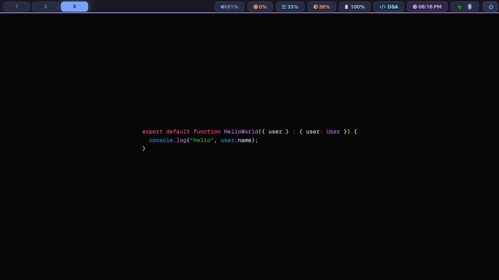
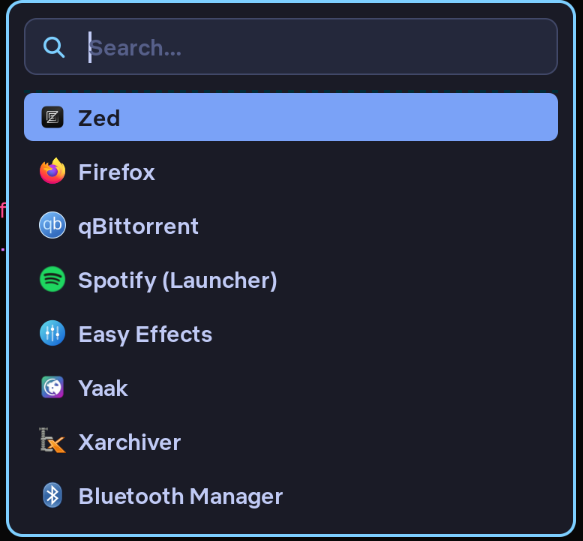
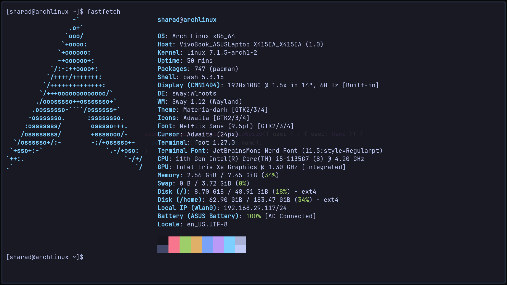
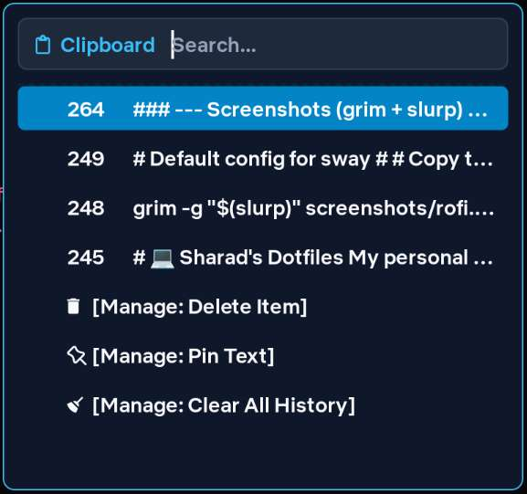
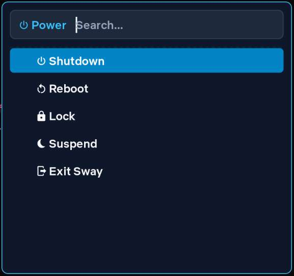

# 💻 Sharad's Arch Linux Dotfiles

My personal Arch Linux setup running **Sway** on an **ASUS VivoBook 14**. Built around an immersive, vibrant **Tokyo Night** theme, lightweight Wayland utilities, and a clean tiling workflow.

### 📸 Screenshots

#### Top Bar (Waybar)


#### Desktop & Workspaces



#### Core Utilities (Launcher & Terminal)

|      Application Launcher (`rofi`)       |              Terminal (`foot`)               |
| :--------------------------------------: | :------------------------------------------: |
|  |  |

#### Rofi Scripts & Workflows

|              Clipboard Manager               |                 Power Menu                 |
| :------------------------------------------: | :----------------------------------------: |
|  |  |

### 🎨 Theme & Appearance

- **Window Manager:** Sway (`1920x1080 @ 1.5x` scale on `eDP-1`)
- **Palette:** **Tokyo Night** (`#1a1b26` dark background, `#7aa2f7` blue & `#bb9af7` purple accents)
- **Status Bar:** Waybar (Top bar with pill-style Tokyo Night modules)
- **Launcher:** Rofi (Customized compact Tokyo Night launcher & scripts)
- **Terminal:** Foot (`JetBrainsMono Nerd Font` @ `11.5pt` with Tokyo Night colors)
- **Editor:** Zed / Neovim
- **UI & Bar Font:** `Netflix Sans Medium` (`9.5pt`) _(Bundled under `.local/share/fonts/`)_
- **GTK / Icons:** `Materia-dark` + `Adwaita`

### 🛠️ Hardware & Essential Fixes

#### Laptop Specs

- **Device:** ASUS VivoBook 14 (`X415EA_X415EA`)
- **CPU:** 11th Gen Intel® Core™ i5-1135G7
- **GPU:** Intel® Iris® Xe Graphics

#### 🎤 ASUS Vivobook Mic Fix (ALC256)

The internal microphone on this Tiger Lake laptop doesn't work out of the box on Arch. It needs explicit driver routing via `/etc/modprobe.d/alsa-base.conf`:

```ini
options snd-hda-intel model=alc256-asus-aio
options snd-intel-dspcfg dsp_driver=1
```

### ⌨️ Custom Keybindings & Workflow

| Keybinding        | Action                                                  |
| ----------------- | ------------------------------------------------------- |
| `Mod + Return`    | Open `foot` terminal                                    |
| `Mod + d`         | Open Rofi launcher                                      |
| `Mod + t`         | Open Thunar file manager                                |
| `Mod + v`         | Open Rofi Clipboard history (`cliphist`)                |
| `Mod + Shift + e` | Open Rofi Power Menu                                    |
| `Print`           | Capture full screen to `~/Pictures/Screenshots/`        |
| `Shift + Print`   | Select region with `slurp` to `~/Pictures/Screenshots/` |
| `Mod + Shift + s` | Select region with `slurp` directly to **Clipboard**    |
| `Mod + Print`     | Capture full screen directly to **Clipboard**           |

### 📂 What's In Here?

```text
dotfiles/
├── .config/
│   ├── easyeffects/     # Audio processing & EQ
│   ├── foot/            # Foot terminal configuration (Tokyo Night)
│   ├── gtk-3.0/         # GTK3 dark theme settings
│   ├── gtk-4.0/         # GTK4 dark theme settings
│   ├── mako/            # Notification daemon
│   ├── rofi/            # Compact Tokyo Night launcher & custom scripts
│   │   └── scripts/     # todo, clip, powermenu scripts
│   ├── sway/            # Sway config, keybinds, Tokyo Night borders, wallpapers
│   ├── swayimg/         # Image viewer configuration (Tokyo Night theme)
│   ├── swaylock/        # Screen locker
│   ├── waybar/          # Waybar config and Tokyo Night CSS tokens
│   └── zed/             # Zed editor config
├── .local/
│   └── share/
│       └── fonts/       # Custom Netflix Sans font family
├── etc/
│   └── modprobe.d/      # Audio fix for ASUS Tiger Lake mic
├── screenshots/         # Desktop previews
├── pkglist.txt          # Native pacman package dump
└── aur_pkglist.txt      # AUR package dump

```

### 🚀 How to Restore on a Fresh Install

#### 1. Grab Packages

```bash
# Sync native packages
sudo pacman -Syu --needed - < pkglist.txt

# Sync AUR packages (if using yay)
yay -S --needed - < aur_pkglist.txt

```

#### 2. Copy Configs & Fonts

```bash
cd ~/dotfiles

# Copy user configs
cp -ur .config/{easyeffects,foot,gtk-3.0,gtk-4.0,mako,rofi,sway,swayimg,swaylock,waybar,zed} ~/.config/

# Copy custom fonts and update cache
mkdir -p ~/.local/share/fonts
cp -ur .local/share/fonts/* ~/.local/share/fonts/
fc-cache -fv

# Ensure scripts are executable
chmod +x ~/.config/rofi/scripts/* ~/.config/waybar/scripts/* 2>/dev/null

```

#### 3. Apply Mic Fix

```bash
sudo cp -r etc/modprobe.d/* /etc/modprobe.d/

```

### 🔄 Quick Update Commands

When making changes locally, sync back to this repo and push:

```bash
cd ~/dotfiles

# Sync updated configs and fonts
cp -ur ~/.config/{easyeffects,foot,gtk-3.0,gtk-4.0,mako,rofi,sway,swayimg,swaylock,waybar,zed} .config/
cp -ur ~/.local/share/fonts/NetflixSans .local/share/fonts/ 2>/dev/null || true

# Refresh package snapshots
pacman -Qqen > pkglist.txt
pacman -Qqem > aur_pkglist.txt

# Commit
git add .
git commit -m "style(dotfiles): update configs to Tokyo Night theme and sync package lists"
git push

```
